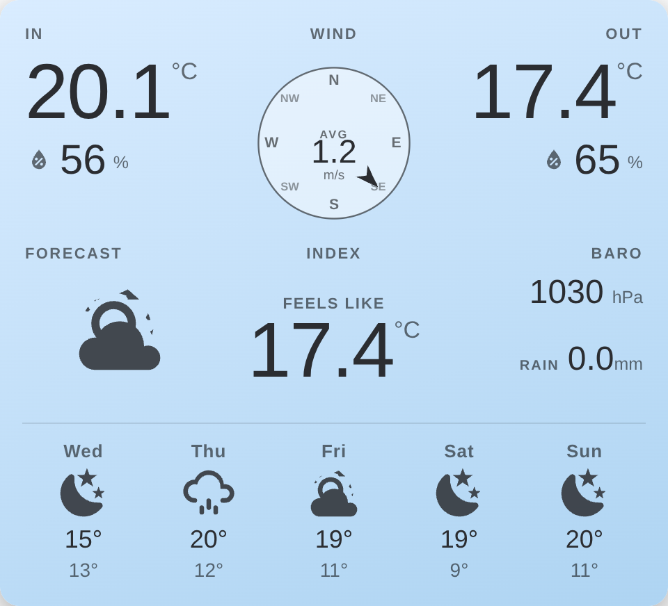
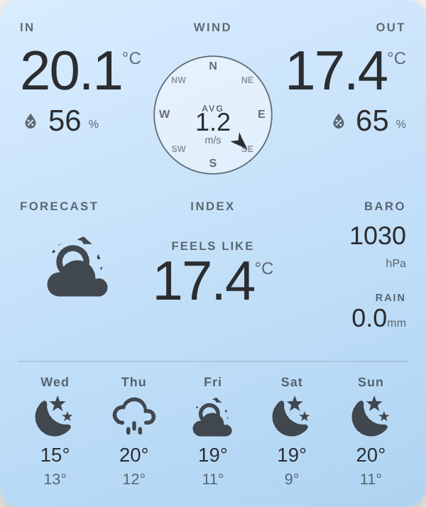

# Weather Station Card

A [Home Assistant](https://www.home-assistant.io/) Lovelace card laid out like a home **weather console**: indoor and outdoor temperature & humidity, a wind compass, feels-like index, barometer, rain, a forecast icon and an optional 5-day forecast — all on a single glanceable panel.

Three style modes, matching the other cards in this family: **Basic** follows your dashboard theme, **Theme** applies any installed HA theme to just this card, and **Custom** paints a gradient — defaulting to the soft-blue of [sensibo-thermostat-card](https://github.com/mycrouch/sensibo-thermostat-card) so it sits naturally beside it.



Resizes to fit narrow section columns:



Built as a single self-contained vanilla custom element: no build step, no external assets, all glyphs are inline SVG.

## Features

- **Indoor & outdoor blocks** — big temperature readout with humidity (water-drop icon) beneath.
- **Wind compass** — cardinal rose with a rotating direction arrow and average wind speed in the centre.
- **Index, Baro, Rain** — feels-like/heat-index, barometric pressure and rainfall today.
- **Forecast icon** — mapped from any `weather.*` entity.
- **Optional 5-day forecast row** — toggle on a daily forecast strip (day, condition icon, high/low) pulled live from the weather entity via the HA forecast websocket API. Configurable number of days (1–7).
- **Moon phase & clock** — locally computed moon phase plus a live clock and date; both toggleable.
- **Any entity, any integration** — every reading is a configurable entity slot. Indoor temp/humidity can read a plain sensor **or an attribute** (e.g. a climate entity's `current_temperature` / `current_humidity`), so it works even when your outdoor integration (Weather Underground, etc.) doesn't expose indoor readings.
- **Three style modes** — **Basic** (inherits theme variables), **Theme** (any installed HA theme applied to just this card), or **Custom** (a gradient; defaults to a soft-blue matching the Sensibo card). Text ink adapts automatically.
- **Responsive** — everything scales with the card's own width (CSS container queries), so it fits wide layouts and narrow section columns alike; Baro/Rain stack their labels when space is tight.
- **Tap to drill in** — every value opens the entity's more-info dialog.
- **GUI editor** — full visual configuration, no YAML required.

## Installation

### HACS (custom repository)

1. HACS → ⋮ → **Custom repositories**.
2. Add `https://github.com/mycrouch/weather-station-card`, category **Dashboard** (Lovelace).
3. Install **Weather Station Card**, then hard-refresh the browser.

### Manual

1. Copy `weather-station-card.js` to `/config/www/`.
2. Dashboard → ⋮ → **Edit** → ⋮ → **Manage resources** → add `/local/weather-station-card.js` as a **JavaScript module**.

## Configuration

Add the card from the picker (**Weather Station Card**) and use the visual editor, or configure in YAML.

```yaml
type: custom:weather-station-card
indoor_temp_entity: climate.living_area
indoor_temp_attribute: current_temperature
indoor_humidity_entity: climate.living_area
indoor_humidity_attribute: current_humidity
outdoor_temp_entity: sensor.station_temperature
outdoor_humidity_entity: sensor.station_relative_humidity
wind_speed_entity: sensor.station_wind_speed
wind_dir_entity: sensor.station_wind_direction_degrees
wind_cardinal_entity: sensor.station_wind_direction_cardinal
feels_like_entity: sensor.station_heat_index
pressure_entity: sensor.station_pressure
rain_entity: sensor.station_precipitation_today
forecast_entity: weather.forecast_home
show_moon: true
show_clock: true
```

### Options

| Option | Type | Default | Description |
|---|---|---|---|
| `title` | string | — | Optional title above the panel. |
| `style` | string | `custom` | `custom` (gradient — default), `basic` (follow the dashboard theme), or `theme` (apply one installed theme to just this card). Legacy values `default`/`manual` are auto-migrated to `basic`/`custom`. |
| `theme` | string | — | Installed theme name to apply (only when `style: theme`). |
| `bg_from` / `bg_to` | string | `#d9ecff` / `#aed4f2` | Gradient top / bottom hex (only when `style: custom`). Defaults match the sensibo-thermostat-card pastel "cool" gradient (160° direction). |
| `indoor_temp_entity` | entity | — | Indoor temperature source. |
| `indoor_temp_attribute` | string | `current_temperature` | Attribute to read (blank = entity state). |
| `indoor_humidity_entity` | entity | — | Indoor humidity source. |
| `indoor_humidity_attribute` | string | `current_humidity` | Attribute to read (blank = entity state). |
| `outdoor_temp_entity` | entity | — | Outdoor temperature. |
| `outdoor_humidity_entity` | entity | — | Outdoor humidity. |
| `wind_speed_entity` | entity | — | Wind speed (unit read from the sensor). |
| `wind_dir_entity` | entity | — | Wind direction in degrees (drives the arrow). |
| `wind_cardinal_entity` | entity | — | Wind direction cardinal (N/NE/…). |
| `feels_like_entity` | entity | — | Feels-like / heat index. |
| `pressure_entity` | entity | — | Barometric pressure. |
| `rain_entity` | entity | — | Rainfall today. |
| `forecast_entity` | entity | — | A `weather.*` entity for the forecast icon and the daily forecast row. |
| `show_forecast` | boolean | `false` | Show the daily forecast strip below the panel. |
| `forecast_days` | number | `5` | How many days to show in the forecast strip (1–7). |
| `show_moon` | boolean | `true` | Show the moon-phase glyph. |
| `show_clock` | boolean | `true` | Show the clock and date. |

Units are taken from each sensor's `unit_of_measurement`, so °C/°F, km/h vs m/s, hPa vs mbar all follow your entities.

## Notes

- Indoor readings default to reading a **climate** entity's `current_temperature` / `current_humidity` attributes — handy when your weather integration has no indoor sensor. Point them at a plain sensor and clear the attribute field to use the state instead.
- The clock/date use the browser's local time.
- Moon phase is an approximation (Conway) computed on-device; no sensor required.

## Related projects

| Project | Description |
|---|---|
| [airtouch-card](https://github.com/mycrouch/airtouch-card) | State-driven AirTouch AC control card. |
| [ecovacs-vacuum-card](https://github.com/mycrouch/ecovacs-vacuum-card) | Ecovacs / Deebot vacuum card. |
| [sensibo-thermostat-card](https://github.com/mycrouch/sensibo-thermostat-card) | Thermostat-style Sensibo AC card. |
| [gradient-themes](https://github.com/mycrouch/gradient-themes) | Shared gradient theme palette. |

## License

MIT © Jason Crouch. Weather, moon and comfort glyphs are [Material Design Icons](https://pictogrammers.com/library/mdi/) (Apache 2.0).
